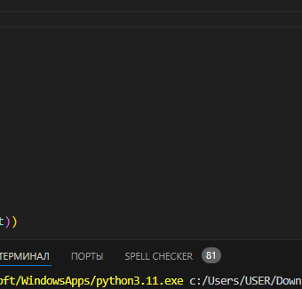

# Змейка
## описание 
Этот проект представляет собой простую игру "Змейка", написанную на Python
## установка
требуется Python 3
У вас должна быть установлена библиотека pygame
## правила 
Игрок управляет змейкой, которая движется по игровому полю. 
Змейка должна собирать еду (например, блоки), которая появляется на поле. Каждый раз, когда змейка съедает еду, она становится длиннее.
Игра заканчивается, если змейка сталкивается с собой или с границами игрового поля.
## управление 
Для управления змейкой используйте клавиши стрелок влево и вправо
при проигрыше следуйте указаниям на экране
## скриншоты

